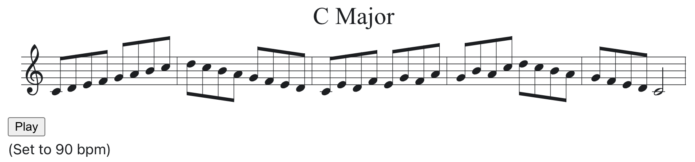

# Website

This website is built using [Docusaurus](https://docusaurus.io/), a modern static website generator.

It serves primarily as a demo and test site for React components that use the [abcjs](https://www.abcjs.net/) library from Paul Rosen to display and play music that has been encoded per the [ABC](https://abcnotation.com/) standard.

This demo uses an MDX file to demonstrate the usage of the React components.  This makes it very easy to embed music in a blog or documentation page with site generators that can process MDX (such as this Docusaurus example, and Gatsby with the [gatsby-plugin-mdx](https://www.gatsbyjs.com/plugins/gatsby-plugin-mdx/))  The examples can easily be used directly in React JSX code as well.

## Example

The `AbcPlayer` converts this ABC text:

```txt
X:1
T:C Major
K:C
CDEF GABc|dcBA GFED|C4z4|
```

to this rendered and playable music:



## Files

This example uses the following files to create the ABC Music Rendering Test page:

### src/components/abc-notation.jsx

This provides the `AbcNotation` React component which takes an ABC music notation string and renders it as SVG based music notation to be inserted on a web page.

## src/components/abc-simple-player.jsx

This provides the `AbcPlayer` React component which extends `AbcNotation` to add audio playback.  It includes a synthesizer and a simple Play/Stop button.

## /docs/music-pages/index.mdx

This is the MDX source for the example "ABC Music Rendering Test" page.

## /docs/music-pages/scales.js

This serves as an example for how to import ABC strings from another file.
